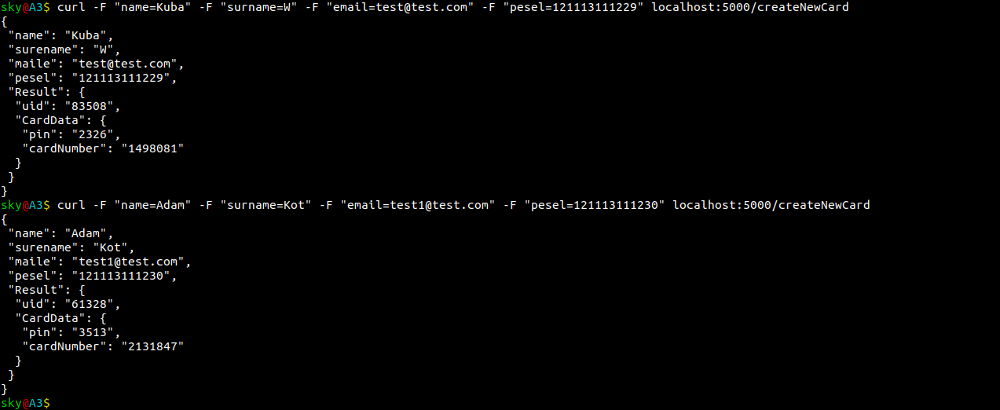

# Quick look at architecture

## Basic concepts

1. First app collect, validate data and push them forward.
2. Second app, check id user exist(create new if not), generate UID, and send data to app 3.
3. App 3 create default PIN and Card Number, and send response to APP 2.
4. App 2 collect UID, PIN and Card Number and go back to App 1.
5. App 1 display all data with UID, PIN and Card Number generate by two different services :)

### Results

