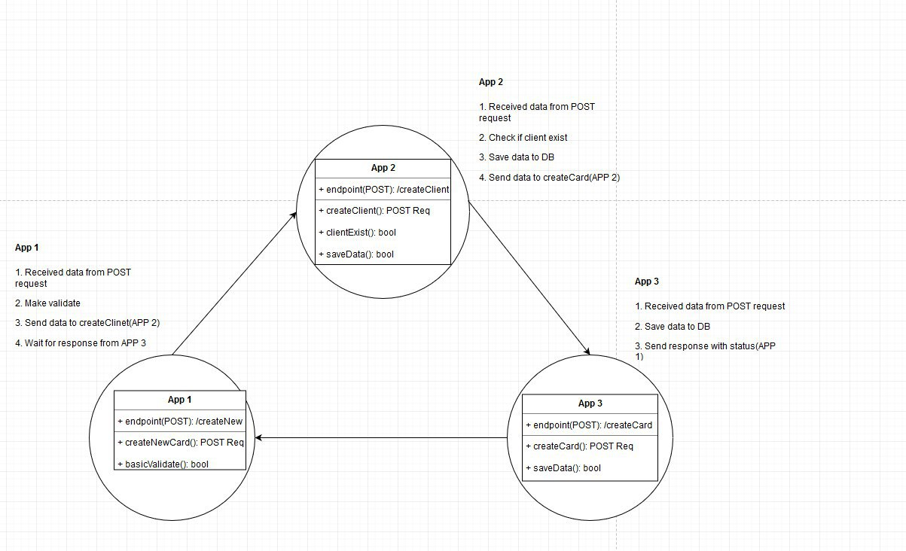
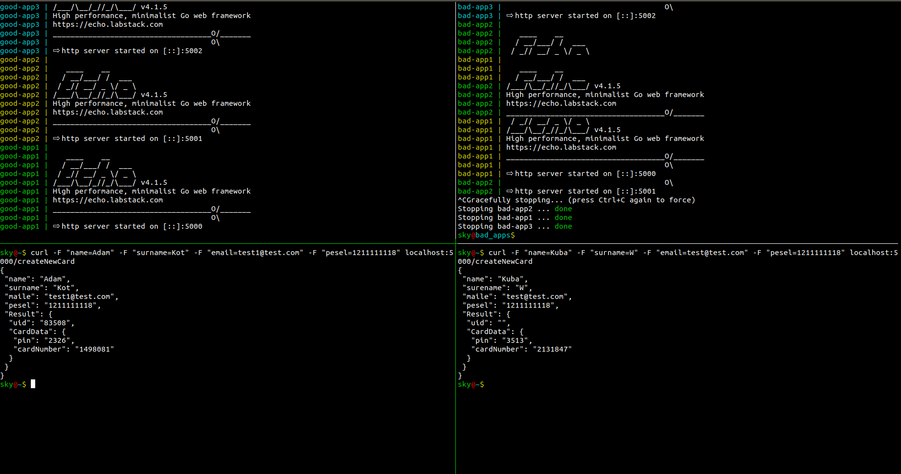

# Quick look at architecture



## Basic concepts

1. First app collect, validate data and push them forward.
2. Second app, check id user exist(create new if not), generate UID, and send data to app 3.
3. App 3 create default PIN and Card Number, and send response to APP 2.
4. App 2 collect UID, PIN and Card Number and go back to App 1.
5. App 1 display all data with UID, PIN and Card Number generate by two different services :)

### Results of using  web-service

```bash
sky@~$ curl -F "name=Adam" \
-F "surname=Kot" \
-F "email=test1@test.com" \
-F "pesel=12111111132" localhost:5000/createNewCard

{
 "name": "Adam",
 "surname": "Kot",
 "maile": "test1@test.com",
 "pesel": "12111111132",
  "Result": {
  "uid": "53987",
   "CardData": {
     "pin": "6218",
      "cardNumber": "2902081"
    }
  }
}
```
### Unit tests results - looks good

```bash
sky@A1$ go test -v
=== RUN   TestGetStatus
--- PASS: TestGetStatus (0.00s)
=== RUN   TestBasicValidate
--- PASS: TestBasicValidate (0.00s)
=== RUN   TestSendDataToApp2
--- PASS: TestSendDataToApp2 (0.00s)
=== RUN   TestCreateNewCard
--- PASS: TestCreateNewCard (0.00s)
PASS
ok  	_/home/sky/Documents/code/Go/testowanie-jednostkowe-w-aplikacjach-w-systemie-rozproszonym/3sky/good_apps/A1	0.020s

sky@A2$ go test -v
=== RUN   TestCheckUserExist
--- PASS: TestCheckUserExist (0.00s)
=== RUN   TestGetStatus
--- PASS: TestGetStatus (0.00s)
=== RUN   TestCreateNewCard
--- PASS: TestCreateNewCard (0.00s)
=== RUN   TestCreateClient
--- PASS: TestCreateClient (0.00s)
PASS
ok  	_/home/sky/Documents/code/Go/testowanie-jednostkowe-w-aplikacjach-w-systemie-rozproszonym/3sky/good_apps/A2	0.017s


sky@A3$ go test -v
=== RUN   TestCreateCard
--- PASS: TestCreateCard (0.00s)
PASS
ok  	_/home/sky/Documents/code/Go/testowanie-jednostkowe-w-aplikacjach-w-systemie-rozproszonym/3sky/good_apps/A3	0.014s
```

### How to simulate classic micro-services problems ?

1. Create two separate `docker-compose` file with different apps.
1. Make some small change in code with real-world situation example:
  - Someone responsible for app 2 said that `nuid` is better than `uid` and change it.
  ```go
  type Account struct {
  	UID      string `json:"nuid"`
  	CardData Card
  }
  ```
  - But team responsible for app 1 have no idea about change and still use JSON tag `uid`
  ```go
  type Account struct {
  	UID      string `json:"uid"`
  	CardData Card
  }
  ```
  - Unit tests still works great
  - But... the result is:
    

  - We missed `uid`, but Unit test are passed. And that is problem with integration between components. 
